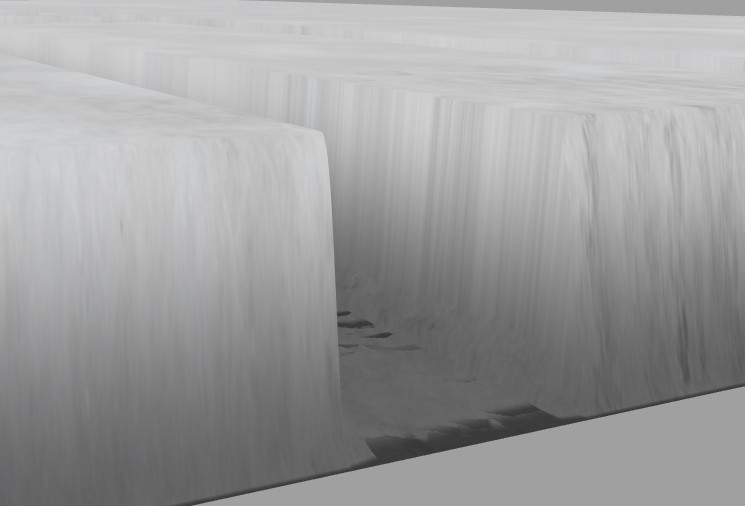

<!-- pandoc -f markdown+lists_without_preceding_blankline -V geometry:margin=1in ataskaita.md --pdf-engine=xelatex -o a.pdf -->

## Aprašas
Dinaminė sniego bei kitokio paviršiaus deformacija padeda suteikti
geresnį realistiškumo jausmą žaidimuose. Norėjau išsiaiškinti kaip
galima pasiekti tokį efektą.

## Trečios šalies bibliotekos

Įgyvendinimui pagrindinės trečios šalies bibliotekos:
- Three.js - kompiuterinės grafikos biblioteka
- Cannon-es - fizikos biblioteka

Taip pat buvo naudojamos kelios papildomos dėl paprastumo/debugginimo:
- cannon-es-debugger - rodo cannon-es kūnų wireframe'us
- three-mesh-bvh - paspartina three.js raycast operacijas
- three-to-cannon - sugeneruoja kūnam bounding-box'us pagal three.js mesh'ą

## Įgyvendinimas

Įgyvendinimas buvo atliekamas keliais etapais iki kol pasiekiau
galutinį, optimaliausią variantą.

Bandymų metu pats deformacijos piešimo metodas nesikeitė, tačiau keitėsi
kaip deformacija buvo aptinkama.

## Deformacijos piešimas

Paprasčiausia dalis viso projekto buvo pačios deformacijos
atvaizdavimas. Piešimui pasirašiau pakankamai paprastą GLSL vertex ir
fragment shaderį, kuris buvo paduodamas plokštumos piešimui.

Į shaderius buvo paduodama deformacijos tekstūra, kurioje balta spalva
reprezentavo deformacijos nebuvimą, o juoda spalva pilną deformaciją.
Naudojant šią tekstūrą, vertex shaderyje buvo pakeičiamos galutinės
vertice pozicijos. Šalia to, teko uždėti limitaciją, kad aplink
plokštumos kampus deformacija visada būtų pilna, kadangi kitu atveju
matytųsi tarpas tarp nulinės ir pilnos deformacijos.

Fragment shaderyje, atsižvelgiant į esančią deformaciją, sniegui
priskiriame skirtingą spalvą. Parinkta spalva uždedama ant naudojamos
sniego tekstūros.

## Pradinis variantas - fizikos objektais paremta deformacija

Pirmas ir papraščiausias metodas kurį išbandžiau buvo turėti, šalia
automobilio, dar ir 'heightfield' - iš esmės dinaminio aukščio fizikinis
objektas, kuris automobilio neįtakoja, bet tik generuoja susidūrimus.

Susidūrimo metu, būtų išsiunčiamas spindulys (raycast) nuo susidūrimo
taško į plokštumos apačią. Tada spindulio ilgis paimamas kad nuspręsti
kiek sniegas tūrėtų būti 'įspaustas'. Taip pat buvo atsižvelgiama į
atstumą nuo objekto. Kuo arčiau objekto, tuo didesnis aplinkinis
įspaudimas.

Su įprastu automobilio modeliu šis principas veikė pakankamai gerai,
tačiau nemažai laiko reikėjo apskaičiuoti fizikos veiksmam. Ypatingai jautėsi
norint turėti didesnį tikslumą su tankesniais heightfield'ais arba
norint pridėti aukštesnio detalumo modelį.

Jeigu į sceną įdedamas detalesnis modelis, reikėtų rinktis arba labai
ilgus ir sudėtingus apskaičiavimus, kadangi collision mesh'ai būtų labai
komplikuoti, arba galima priskirti modeliui paprastesnį collision
mesh'a, tačiau tuomet deformacija netiksliai atitiktų to, kas
vaizduojama ekrane.

Taip pat, šis metodas nesuteikia pakankamai tikslumo, kad būtų galima
atvaizduoti padangos raštą sniege.

## Antrinis variantas - Scenos atstumo buferio paremta deformacija

Kadangi grafinės kortos yra ženkliai spartesnės nei įprasti procesoriai,
kodėl gi nepasitelkus jų sugebėjimais, kad paspartinti patį procesą bei
padaryti deformaciją tikslesnę?

Grafinės kortos šalia įprasto piešimo turi galimybę taip pat nupiešti ir
scenos „gilumą" (depth).

Kadangi šis depth bufferis atvaizduoja visą tai, ką mato kamera, pačio
gilumo raiška labai aukšta - įvairūs smulkūs įdubimai modeliuose
atsispindi juose.

Antras variantas visiškai nenaudoja fizikos bibliotekos deformacijos (ji
naudojama tik automobilio judėjimui). Vietoje to, mes panaudojame kelis
papildomus render target'us (tekstūras, į kurias galime piešti scenas).

Pirmas render target'as yra mūsų įprasta scena, tačiau naudojame kamerą,
kuri yra padėta po plokštuma, žiūrint aukštyn. Jos near/far clipping
plane'as nustatytas kad būtų tarp mūsų sniego minimalios ir maksimalios
deformacijos (t.y. tolimesni objektai nesimato). Kadangi sniego
plokštumai mes piešiame tik išorinius face'us, kameros vaizdo pats
sniegas nekliudo (jei kliudytų, yra įmanoma laikinai išjungti objektų
matomumą scenoje).

Iš pirmo render target'o, mes paimame detalų depth bufferi - jame mes
matysime kur šiuo metu yra objektai, kurie turėtų deformuoti sniegą.

Antrame render target'e, mes paimame pirmo render target'o tekstūrą, bei
kartu mūsų dabartinę išorės tekstūrą. Rezultate mes sujungiame dvi
tekstūras taip, kad ten kur buvo deformacija, ji liktų, o ten kur
nebuvo - atsirastų `spalva = min(dabartinio_gylio, praeito_gylio)`.

Tuomet, šią tekstūrą kartu su CPU perpiešiame ant canvas tekstūros, kuri
naudojama mūsų sniego deformacijos plokštumoje.

Galų gale, naudojame trečią render target'a, būtų galima nupiešti

Šis metodas leidžia mums turėti ženkliai didesnę deformacijos raišką
naudojant detalesnius modelius ir tai būtų greičiau nei praeitas
sprendimas - be jokių brangių fizikos objektų susidūrimo apskaičiavimų
(deformacijai fizikos sistemos išvis nereikia).

Siekiant didesnio tikslumo žymiai padidinau tekstūros dydį, tačiau
naudojant 2K (2048x2048) dydžio tekstūras -- pastebėjau, kad FPS'ai
smarkiai sumažėjo.

Atlikdamas šiek tiek profilinimo supratau, kad daugiausiai laiko
reikalaujanti dalis yra perpiešimas iš antro render target'o į CPU
atmintyje esančią tekstūrą.

## Galutinis, optimizuotas variantas

CPU atmintyje esanti tekstūra buvo ganėtinai svarbi - jos dėka galėjome
matyti šone ekrano dabartinę sniego deformacijos tekstūrą bei piešti ant
jos su pele. Tačiau norėjau įsitikinti ar būtų įmanoma kaip nors
panaikinti šį žingsnį.

Kad jį panaikinti pasinaudojau papildomu render target'u (alternatyvus
sprendimas būtų sukurti dar vieną tekstūrą). Su šiuo variantu pavyko
pasiekti 180fps (max ekrano refresh rate, matuota su RTX 3080).

## Potencialus optimalesnis variantas ant mažiau galingų grafiniu kortų

Dėja, ant lėtesnių kompiuteriu, FPS'ai vis tiek nėra itin geri. Su M1
macbook pro - tik 60fps su 2048x2048 tekstūra + plokšuma.

Manau, kad taip yra dėl to, kad plokštuma turi labai daug verteksų. To
galima išvengti naudojant 'tesellation', kad vietose kur deformuota
suteiktų daugiau verteksų, o kitose vietose nedaug, tačiau GPU
accelerated variantas iš WebGL nėra pasiekiamas, todėl tektų daryti
on-CPU, kas greičiausiai vis tiek būtų lėčiau nei dabar yra.